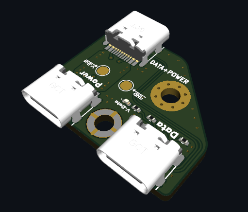

# PD-Injector 

Based on earlier versions by [Jana-Marie Hemsing](https://github.com/Jana-Marie/PD-Injector), [Clara Hobbs](https://git.clarahobbs.com/pd-buddy/pd-buddy-wye), and [tinyledmatrix](https://github.com/tinyledmatrix/PD-Injector-SMD).

This is a USB power delivery Power/Data injector. This version uses all USB-C receptacles. The data lines from one input and the power lines from the other are combined and present at the output. Therefore you can have a data connection from your(not PD capable) computer, while having power from a power supply. It only connects the USB2.0 data lines.

Why? Earlier versions appear for Android Auto, where the head unit was insufficient to charge while running. I'm using this to program devices while powered, e.g. the [PINECIL](https://wiki.pine64.org/wiki/Pinecil_Power_Supplies) and that [tiny hotplate](https://www.adafruit.com/product/4948), and potentially run a 3D printer toolhead over USB instead of CAN+Power. These [HUSB328-based USB-C trigger boards](https://www.amazon.com/Coolgear-Delivery-Injector-Type-C-Device/dp/B075F6BD4Y/) are helpful for debugging. 

# License
CERN Open Hardware Licence v1.2.  See LICENSE for more information.
