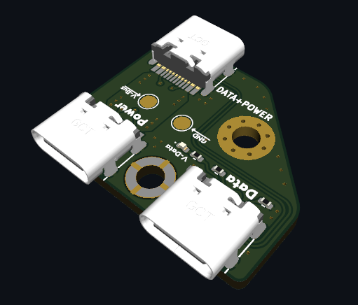
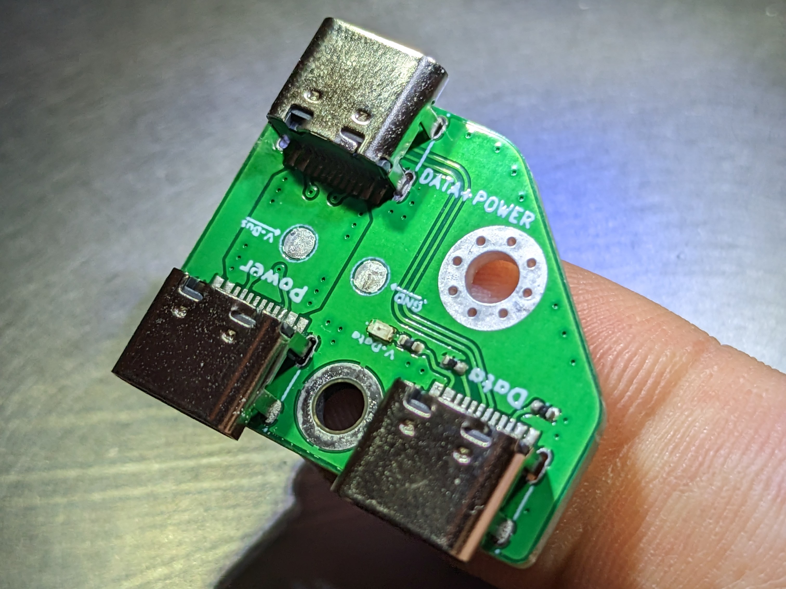
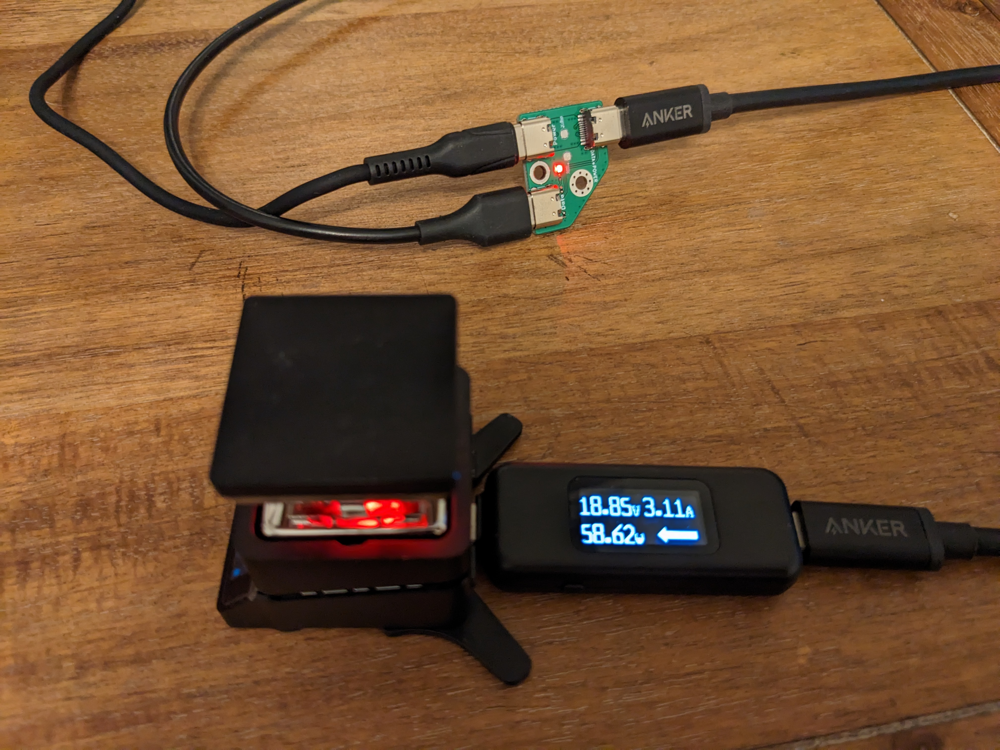
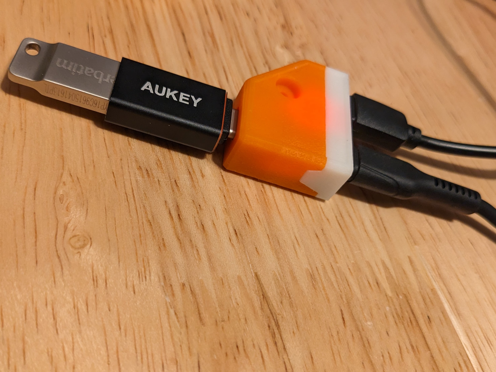

**!!! Use at your own risk. 
May kill USB ports or worse. !!!**

Definitely don't connect two USB-C-to-A cables between your two favorite computers.

# PD-Injector 

Based on earlier versions by [Jana-Marie Hemsing](https://github.com/Jana-Marie/PD-Injector), [Clara Hobbs](https://git.clarahobbs.com/pd-buddy/pd-buddy-wye), and [tinyledmatrix](https://github.com/tinyledmatrix/PD-Injector-SMD).

This is a USB power delivery Power/Data injector. This version uses all USB-C receptacles. The data lines from one input and the power lines from the other are combined and present at the output. Therefore you can have a data connection from your (not PD capable) computer, while having power from a power supply. It only connects the USB2.0 data lines. Two receptacles means you will need to orient the power cables in the same direction.

Why? Earlier versions appear for Android Auto, where the head unit was insufficient to charge while running. The [Coolgear PD Injector](https://www.coolgear.com/product/usb-c-usb-b-power-delivery-adapter-wmounting-kit) is expensive. I'm using this to program devices while powered, e.g. the [PINECIL V2 soldering iron](https://wiki.pine64.org/wiki/Pinecil_Power_Supplies) and that [MHP30 tiny hotplate](https://www.adafruit.com/product/4948), and potentially run a 3D printer toolhead over USB instead of CAN+Power. These [HUSB328-based USB-C trigger boards](https://www.amazon.com/Coolgear-Delivery-Injector-Type-C-Device/dp/B075F6BD4Y/) are helpful for debugging. 

Interestingly, the Pinecil and MHP30 both use the Onsemi FUSB302MPX, but the Pinecil will not power if the second cable is an active cable like Thunderbolt, while the MHP30 will just fine.

  
  

90 W power supply to read a USB-A thumb drive? Sure.

[//]: # (Connecting two devices with USB Type C receptacles with a USB Type C cable is the intended use. But if one receptacle isn't a device but a passive board, that's a problem.)
[//]: # (An E-Marker is required on all USB Type-C cables that support 5 amps and/or exceed 60 watts of power carrying capability)

# License
CERN Open Hardware Licence v1.2.  See LICENSE for more information.

## References
- [USB.org PD](https://www.usb.org/sites/default/files/D2T2-1%20-%20USB%20Power%20Delivery.pdf)
- [USB.org card edge gerbers](https://www.usb.org/document-library/usb-type-c-cable-assembly-signal-integrity-test-fixture-gerber-files)